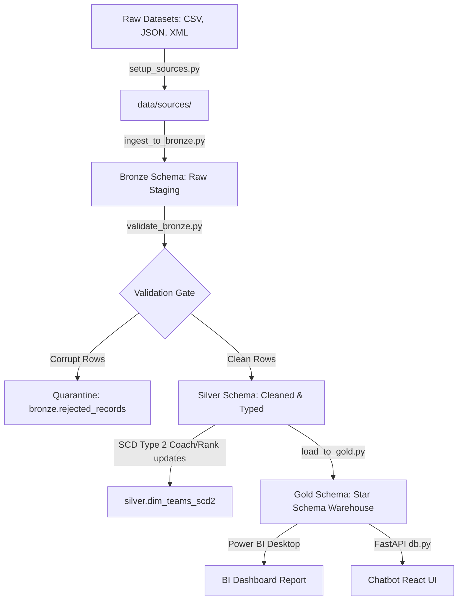

# FIFA World Cup Data Pipeline & Agentic AI Chatbot PoC

An end-to-end data engineering and generative AI proof-of-concept (PoC). This project combines a structured **Medallion Architecture** data warehouse (storing historical World Cup data from 1930 to 2026) with a **Multi-Role Agentic AI Chatbot** that queries database tables in real-time to answer natural language questions.

*   **Live Web Application**: [https://fifa-world-cup-medallion-pipeline.vercel.app/](https://fifa-world-cup-medallion-pipeline.vercel.app/)
*   **FastAPI Backend API**: `https://fifa-chatbot-backend.onrender.com`
*   **Database Host**: Neon Serverless PostgreSQL

---

## 🛠️ Technology Stack

| Component | Technology | Role |
| :--- | :--- | :--- |
| **Orchestration** | Apache Airflow 2.7.2 / Docker | Workflow task scheduling and dependency execution |
| **Data Processing** | Python 3.10 / Pandas | Ingestion, format parsing (CSV/JSON/XML), and schemas |
| **Database** | PostgreSQL 15 (Neon / local Docker) | Data warehouse storing bronze, silver, gold, and metadata |
| **AI Agent Engine** | Google Gemini API (1.5 Flash) | Generative LLM tool calling and natural language parsing |
| **Backend API** | FastAPI / Uvicorn (Render) | Server hosting chat routing, query utilities, and CORS |
| **Frontend UI** | React 18 / Tailwind CSS (Vercel) | Premium Dark glassmorphic user interface and data grids |
| **BI & Analytics** | Power BI Desktop | Interactive analytical dashboards and commercial trend forecasting |

---

## 📐 Data Pipeline Loop (Medallion Architecture)

The pipeline is divided into three conformed database layers:



1.  **Bronze (Raw Landings)**: Loads raw matches (CSV), team ranks (JSON), and editions (XML) into DB staging tables, appending audit metadata (ingestion timestamp, file source, and a unique pipeline `run_id`).
2.  **Schema Validation & Quarantine**: The `validate_bronze.py` engine checks rows for null primary keys, data type conformity, and duplicate constraints. Clean rows pass to Silver staging; corrupt rows are quarantined in `bronze.rejected_records` with an audit description.
3.  **Silver (Cleaned & Historical)**: Standardizes conformed fields, performs lookup joins to map continent abbreviations to full confederation names (using `silver.lkp_confederations`), and executes a **Slowly Changing Dimension (SCD) Type 2** merge algorithm to version historical coach and rank updates.
4.  **Gold (Analytical Star-Schema)**: Organizes conformed tables into dimension models (`dim_teams`, `dim_editions`) and transaction tables (`fact_matches`), builds KPI summaries (`kpi_summary`), and ranks scorers using SQL window functions (`RANK() OVER (PARTITION BY edition_id ORDER BY goals DESC)`).

---

## 🔮 Agentic AI Chatbot Loop (3 Specialized Roles)

The chatbot coordinates three specialized generative agent roles in `chatbot/backend/tools.py` using Google Gemini's system instructions:

1.  **Support Agent**: Handles questions about system status, database health, and warehouse table schema layouts.
2.  **Data Agent (SQL Engine)**: Receives natural language questions, writes optimized read-only PostgreSQL SELECT queries, runs them against the Neon database using a restricted `chatbot_readonly` database role, and returns the result as interactive tabular grids and charts.
3.  **ML Forecasting Agent**: Identifies predictive questions (e.g. *"Predict the champion of the 2030 World Cup"*), reviews historical winner distributions and host country statistics, and generates statistical projections.

---

## 🚀 Cloud Production Deployment (Neon, Render & Vercel)

The system is deployed in the cloud using a modern serverless PaaS architecture:

*   **Database (Neon)**: The PostgreSQL data warehouse is hosted on a Neon serverless instance. Tables are initialized, and data is loaded using local conformed CSV backups.
*   **Backend API (Render)**: The FastAPI chatbot backend is deployed on Render as a Web Service. It automatically compiles using the Dockerfile inside `chatbot/backend/` and connects to Neon over secure SSL.
*   **Frontend (Vercel)**: The React chatbot frontend is deployed to Vercel, pointing to the Render API endpoint for global secure access.

---

## 💻 Local Startup & Execution Guide

If you want to run the pipeline and database locally on your host machine:

### 1. Start Infrastructure via Docker Compose
Make sure Docker Desktop is running, then run:
```bash
docker compose up -d --build
```
*(Confirms `postgres_fifa` on port `5433` and `airflow_webserver` on port `8080` are active).*

### 2. Synchronize Data Sources
```bash
python scripts/setup_sources.py
```

### 3. Run the ETL Pipeline
Execute the full Medallion pipeline sequentially:
```bash
python scripts/run_pipeline.py
```

### 4. Connect to PostgreSQL Container
To query the tables locally via psql:
```bash
docker exec -it postgres_fifa psql -U postgres -d fifa_dw
```

---

## 📁 Project Directory Structure

```text
├── chatbot/
│   ├── backend/
│   │   ├── agent.py               # Gemini SDK interaction wrapper
│   │   ├── db.py                  # Readonly connection pool & logging utilities
│   │   ├── main.py                # FastAPI endpoints (/chat and /stats)
│   │   ├── tools.py               # AI Agent role system prompts & tools
│   │   └── Dockerfile             # Render build instructions
│   └── frontend/
│       └── index.html             # Glassmorphic React chatbot frontend
├── dags/
│   └── fifa_pipeline_dag.py       # Apache Airflow workflow DAG definition
├── data/
│   ├── sources/                   # Conformed multi-source files
│   ├── bronze/                    # Landed immutable raw CSV partition backups
│   ├── silver/                    # Cleansed and conformed CSV backups
│   └── gold/                      # Analytical Star Schema CSV backups
├── scripts/
│   ├── setup_sources.py           # Ingestion raw file manager
│   ├── ingest_to_bronze.py        # Bronze raw landing module
│   ├── validate_bronze.py         # Data Quality validation & Quarantine engine
│   ├── load_to_silver.py          # Lookups lookup joiner & SCD Type 2 engine
│   ├── load_to_gold.py            # Gold star schema loader & KPI compiler
│   ├── run_pipeline.py            # CLI pipeline orchestrator
│   └── simulate_incremental.py    # Test data simulation for SCD2 & appends
├── sql/
│   ├── init_db.sql                # Medallion tables bootstrap script
│   ├── init_awards_schema.sql     # Awards and disciplinary bootstrap script
│   └── chatbot_setup.sql          # Secure readonly roles setup
├── docker-compose.yml             # Local Docker container orchestrator
└── README.md                      # Project documentation
```
